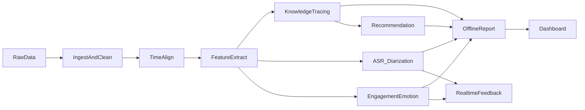

# AI Tutor 调研与产品/技术方案（百万级同格式数据）

基于 `report.md` 的数据结构与质量结论，并结合公开研究与产业实践，形成可落地的产品与技术路线。重点覆盖：离线复盘 + 实时 Tutor 分阶段推进，面向中国合规（PIPL/未成年人保护）。

---

## 1. 研究与技术调研要点（含参考）

### 1.1 智能辅导与学习效果
- AI Tutor 在结构化反馈、适应性教学与学习效率方面具备显著优势（RCT 证据）。  
  https://www.nature.com/articles/s41598-025-97652-6
- 混合人机辅导（Human+AI）对学习薄弱学生帮助明显。  
  https://arxiv.org/abs/2312.11274

### 1.2 知识追踪（KT）与学生模型
- 经典知识追踪框架（BKT）与深度知识追踪（DKT/SAKT/AKT）被广泛用于学习状态估计。  
  https://en.wikipedia.org/wiki/Bayesian_knowledge_tracing
- 可解释型知识追踪（IKT）与可解释性需求持续增长。  
  https://arxiv.org/abs/2112.11209

### 1.3 多模态学习分析（MMLA）与课堂行为识别
- 多模态学习分析（视频+音频+行为日志）是参与度/情绪/互动分析的重要方向。  
  https://www.mdpi.com/2076-3417/15/11/5896
- 课堂视频与课件/Slide 对齐研究（如 MaViLS）可用于内容时间轴对齐。  
  https://arxiv.org/abs/2409.16765

### 1.4 语音识别与发音评估
- 自动语音识别（ASR）在语言学习场景中被大量应用，发音评估与流利度指标可落地。  
  https://learn.microsoft.com/en-us/azure/ai-services/speech-service/language-learning-with-pronunciation-assessment
- 儿童/非母语语音的误读识别需定制模型或迁移学习。  
  https://arxiv.org/abs/2406.03235

### 1.5 学习行为与早期预警
- 行为日志与互动序列能预测长期表现，为早期干预提供依据。  
  https://news.stanford.edu/stories/2025/04/study-edtech-platform-data-intelligent-tutors-student-performance

### 1.6 中国合规与未成年人数据
- 需严格遵循 PIPL/未成年人保护要求：最小化采集、明确授权、脱敏与访问控制。  
  https://www.cac.gov.cn/2021-08/20/c_1631049983934113.htm

---

## 2. 数据资产与可用性判断（基于 report.md）

### 已有结构化资产
- 课件脚本结构（Slide/Section/Function/Content）可作为教学意图与知识点的结构模板。
- 事件日志包含大量行为事件（时间戳、msgid、role、userid）。
- 标注 JSON（label_json）存在结构化字段与 lead_time，需进一步解析用于“行为/回答类型”关联。
- 多路视频（教师/学生/整堂课）具备音轨与时长，可用于语音与互动特征。

### 可直接支撑的能力
- 课堂内容阶段划分与时间轴对齐
- 互动频率、话轮比例、静默时长、参与度统计
- 课后学习报告与趋势画像（基于多课时序）

### 当前短板
- 情绪/专注度标注稀缺（需补标或弱监督）
- 语音转写与话轮分离尚未建立
- 知识点-题目映射体系需要标准化

---

## 3. 产品功能蓝图（分阶段）

### V1：离线复盘 MVP（0-4 个月）
**目标**：课后复盘、教师/家长报告、知识点弱项分析  
- 课堂内容对齐（课件+事件+视频时间轴）
- ASR 转写 + 说话人分离（老师/学生）
- 行为统计与报告（互动频率、响应时长、回放/重复）
- 学生画像（知识点掌握度、错误类型分布）

### V2：增强反馈与个性化推荐（4-8 个月）
**目标**：给出个性化反馈/练习/路径  
- 练习与题目推荐（基于 KT 输出）
- 错误类型分类（语法/词汇/发音/理解）
- 课后反馈生成（文本+要点建议）
- 教师端教学策略建议（节奏、提问密度、难点提示）

### V3：实时 Tutor（8-14 个月）
**目标**：课堂中实时辅助与状态识别  
- 实时状态估计（注意力/困惑/疲劳）
- 实时提示（节奏调整、激励话术、再解释建议）
- 轻量化模型/流式架构

---

## 4. 技术架构与数据流

### 关键组件
- **数据层**：视频/音频/事件日志/脚本/标注统一 schema，分课堂与学生维度索引。
- **对齐层**：以课堂开始为 t=0，统一事件/视频/脚本时间轴。
- **多模态特征层**：语音、文本、视觉、事件统计特征。
- **模型层**：KT（掌握度）、ASR+发音评估、情绪/参与度识别、推荐引擎。
- **服务层**：离线报告生成 + 实时提示服务（低延迟）。

---

## 5. 模型与数据策略

### 知识追踪（KT）
**目标**：知识点掌握概率 + 未来表现预测  
**模型候选**：BKT / DKT / SAKT / AKT / IKT  
**数据输入**：练习/回答事件、错误类型、题目难度、知识点映射  
**输出**：知识点掌握概率、风险学生预警、下一步学习推荐

### 语音与发音评估
**目标**：学生发音准确度与流利度评估  
**模型候选**：ASR + 发音打分（音素级别）+ 流利度指标（停顿/语速）  
**数据输入**：学生音频、标准文本/参考音频  
**输出**：发音评分、错音素定位、可视化反馈

### 参与度/情绪识别
**目标**：专注度、疲劳、困惑等状态估计  
**模型候选**：音频情感特征（openSMILE）+ 视觉表情/姿态模型  
**数据输入**：学生视频、音频特征、行为事件  
**输出**：状态时间序列、触发式干预建议

### 内容与事件对齐
**目标**：课件/脚本/视频/日志统一时间轴  
**方法**：事件时间戳标准化 + ASR 文本与脚本对齐 + slide 切换检测  
**输出**：按“课件片段-事件-语音”对齐后的统一序列

---

## 6. 评估体系与验收指标

### 模型指标
- ASR：WER（词错率）
- KT：AUC / Calibration / RMSE
- 情绪/参与度：Accuracy / F1 / Confusion Matrix
- 发音评估：与人工评分相关性（Pearson/Spearman）

### 业务指标
- 练习完成率提升
- 学生错误率下降
- 课程续课率提升
- 教师/家长满意度（问卷+留存）

---

## 7. 合规与隐私（中国）

### 核心要求
- 明示授权与最小化采集  
- 数据去标识化 / 脱敏  
- 访问控制与审计  
- 视频/音频仅用于教学目的与模型训练，不作其它用途  

### 实施建议
- 不存原始视频时可保留特征向量  
- 训练数据权限分级管理  
- 需建立家长/监护人授权流程

---

## 8. 详细开发路线（分阶段里程碑）

### 阶段 0：数据准备（1-2 个月）
- 统一 schema（事件/课件/标注/视频索引）
- 构建样本校验与质量分层

### 阶段 1：离线复盘 MVP（2-4 个月）
- 视频+事件+脚本对齐
- ASR 转写 + 说话人分离
- 互动统计 + 学生画像报告

### 阶段 2：推荐与反馈（4-8 个月）
- KT 模型上线
- 练习推荐与反馈生成
- 教师仪表板

### 阶段 3：实时 Tutor（8-14 个月）
- 轻量化情绪/参与度识别
- 实时干预策略与提示
- 低延迟流式架构

---

## 9. 风险与缓解策略

| 风险 | 影响 | 缓解 |
|---|---|---|
| 标注不一致 | 模型训练效果不稳 | 统一标注规范 + 抽样复核 |
| 语音噪声/低质视频 | ASR/情绪识别误差高 | 质量分层 + 降噪 + 低质样本降权 |
| 模型难以解释 | 教师信任度下降 | 输出可解释原因 + 典型样本回放 |
| 合规风险 | 数据使用限制 | 隐私评估 + 数据最小化 + 脱敏 |

---

## 10. 结论与建议

在百万级同格式数据基础上，离线复盘 MVP 与个性化推荐是“低风险高产出”的起步路径；实时 Tutor 建议在对齐与模型稳定后推进。  
建议先打通“对齐→ASR→画像→报告”闭环，再逐步引入情绪/参与度与实时策略模块。
