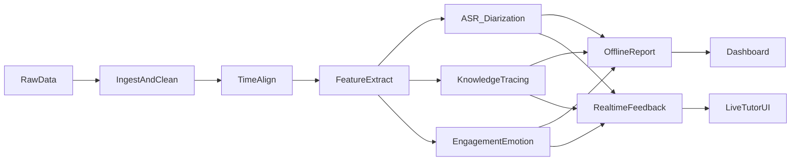

# AI Tutor 实施前方案报告（离线复盘 + 实时 Tutor）

基于现有调研报告 `ai_tutor_research_report.md` 的结论与目标，本报告提供可执行的全链路实现方案，覆盖系统架构、模块实现方式、推荐开源库、建模算法与前后端开发步骤。该报告用于实施前评审与决策。

---

## 1. 目标与范围

- 覆盖 **离线复盘** 与 **实时 Tutor** 两条主链路。
- 以“数据对齐 → 多模态特征 → 模型推理 → 报告与实时提示”闭环为主线。
- 符合中国合规要求（PIPL/未成年人保护），强调数据最小化与可审计。

---

## 2. 总体系统架构

---

## 3. 技术栈与基础设施建议

### 3.1 服务端与数据
- **API 与服务框架**：FastAPI（Python）
- **模型训练/推理**：PyTorch
- **任务调度/ETL**：Prefect 或 Airflow
- **数据库**：PostgreSQL（结构化元数据） + ClickHouse/DuckDB（分析）
- **对象存储**：MinIO（本地/私有）或 S3 兼容服务
- **消息与流式**：Redis Streams 或 Kafka（实时链路）

### 3.2 前端
- **Web**：Next.js + React + Tailwind
- **图表**：Plotly 或 ECharts
- **实时可视化**：WebSocket + Zustand/Redux

---

## 4. 数据结构与存储方案

### 4.1 核心实体
- `ClassSession`：课堂级别元信息
- `StudentProfile`：学生画像与历史表现
- `EventLog`：交互事件（时间戳、事件类型、角色、用户）
- `Utterance`：语音片段（说话人、转写文本、时间跨度）
- `SlideSegment`：课件时间片段
- `Alignment`：对齐结果（事件/语音/课件）
- `FeatureVector`：多模态特征向量

### 4.2 存储分层
- **Raw 层**：视频/音频/日志/脚本原始文件（对象存储）
- **Normalized 层**：对齐后的 JSONL/Parquet
- **Feature 层**：向量与统计特征（列式存储）

---

## 5. 模块化实现方案（含算法与开源库）

### 5.1 数据接入与清洗
- **实现方式**：批处理 ETL + 入库校验
- **关键步骤**：
  - 视频/音频抽取（`ffmpeg`）
  - 事件日志结构化（`pandas`）
  - 规范化输出（`pyarrow`）

### 5.2 时间对齐（课件/事件/语音）
- **算法**：
  - 文本对齐：DTW + 模糊匹配
  - 视觉对齐：关键帧差分 + OCR
- **开源库**：
  - `rapidfuzz`（文本相似度）
  - `opencv-python`（帧差分）

### 5.3 ASR 与说话人分离
- **离线 ASR**：`faster-whisper` 或 Whisper large-v3
- **流式 ASR**：`whisper.cpp` + VAD
- **说话人分离**：`pyannote.audio`
- **输出**：带时间戳的转写 + 说话人标签

### 5.4 发音评估（可选模块）
- **算法**：音素级别比对 + 流利度统计
- **开源库**：`praat-parselmouth` 或 `speechbrain`

### 5.5 参与度/情绪识别
- **算法**：
  - 音频情感特征 + 视觉表情/姿态特征融合
  - 轻量化分类器（XGBoost/MLP）
- **开源库**：
  - `openSMILE`、`librosa`（音频特征）
  - `mediapipe`、`openface`（视觉特征）

### 5.6 知识追踪（KT）
- **模型**：BKT（基线）、DKT、SAKT
- **开源库**：`pykt-toolkit`
- **输入**：题目-知识点映射、答题结果、时间间隔
- **输出**：知识点掌握度、风险预警、下一步建议

### 5.7 离线复盘报告生成
- **实现方式**：
  - 统计 + 规则汇总 + 模型输出整合
  - 模板化报告
- **开源库**：`jinja2`、`plotly` 或 `matplotlib`

### 5.8 实时 Tutor 引擎
- **数据链路**：WebRTC/WebSocket → VAD → ASR → 状态估计
- **策略引擎**：
  - 规则策略：低参与度/长静默 → 触发提示
  - 后续可扩展为 Contextual Bandit（LinUCB）
- **实时缓存**：Redis Streams

### 5.9 前端展示与交互
- **教师端**：
  - 课堂回放时间线
  - 互动频次与话轮比例
  - 知识点掌握与班级弱项
- **实时 Tutor**：
  - 提示弹窗、状态仪表、风险提示列表

---

## 6. 分阶段实施步骤（可执行清单）

### 阶段 0：环境与基础设施（2–4 周）
1. 建立单体仓库与目录结构（前端/后端/模型服务）
2. 搭建 MinIO + PostgreSQL + Redis
3. 建立 CI/CD 与日志/监控框架

### 阶段 1：数据接入与对齐（4–6 周）
1. 完成 ETL 管道（视频/音频/日志/脚本）
2. 实现课件与事件时间对齐
3. 输出统一的课堂对齐序列

### 阶段 2：ASR + 说话人分离（6–8 周）
1. 离线 ASR 模型部署
2. 说话人分离与角色映射
3. 输出 Utterance 数据表

### 阶段 3：特征层与模型（6–10 周）
1. 提取音频/视觉/行为特征
2. 训练 KT 基线模型
3. 形成学生掌握度与风险指标

### 阶段 4：离线报告与仪表盘（6–8 周）
1. 报告模板与统计聚合
2. 教师/家长端仪表盘开发
3. 支持班级与学生画像视图

### 阶段 5：实时 Tutor（6–10 周）
1. 流式 ASR + 情绪/参与度推理
2. 规则策略引擎上线
3. 实时提示 UI 与课堂联动

---

## 7. 评估指标与验收标准

- **ASR**：WER（词错率）≤ 20%（初期）
- **KT**：AUC ≥ 0.70；校准误差可控
- **参与度**：F1 ≥ 0.65（初期）
- **业务指标**：教师满意度、复盘使用率、学生错题下降趋势

---

## 8. 合规与隐私策略

- 数据最小化：仅保留必要音视频与特征
- 访问控制：分级授权与审计日志
- 脱敏策略：标识符与原始内容分离存储

---

## 9. 交付物清单

1. 数据 Schema 与对齐产物
2. ASR + Diarization 模块
3. 多模态特征抽取服务
4. KT 基线模型
5. 离线复盘报告与仪表盘
6. 实时 Tutor MVP

---

## 10. 结论

该实施方案覆盖从数据接入到模型推理、再到前后端展示的完整链路，并明确了每个模块的算法路线与开源组件。若需进入实施阶段，可按分阶段清单逐步落地。

