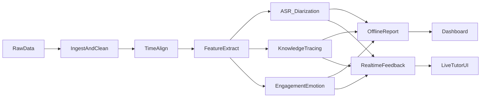

# AI Tutor 甲方讲解方案（含数据分析/方案/架构/成本工期）

本方案面向甲方沟通，基于现有数据分析结果与前期调研，给出可落地的产品实现方案、技术架构设计，并提供开发成本与工期评估（含假设前提）。

---

## 1. 训练数据分析结果（基于现有样例数据）

### 1.1 现有数据资产
- **视频**：教师视频、学生视频、整堂课屏幕录制（含音轨）
- **事件日志**：课堂事件与信令（msgid、role、timestamp 等）
- **课件脚本**：Slide/Section/Function/Content 的结构化文本
- **标注数据**：带 `lead_time` 的标注 JSON
- **信令格式说明**：1v1 信令消息格式文档

### 1.2 数据结构要点
- 课件脚本包含章节/功能/内容结构，可作为教学阶段与意图标签
- 事件日志包含角色、事件类型、时间戳，可用于互动行为统计
- 视频含音频轨道，可用于 ASR 与发言轮次抽取

### 1.3 可直接支持的能力
- 课堂阶段划分与时间轴对齐
- 互动频次、话轮比例、静默时长统计
- 课后学习报告与趋势画像（需多课时）

### 1.4 关键缺口与补齐建议
- **语音转写与话轮分离**尚未建立（需ASR+说话人分离）
- **情绪/专注度标注稀缺**（需补标或弱监督）
- **知识点-题目映射体系**尚不完备（需标准化）

---

## 2. 产品实现方案（离线复盘 + 实时 Tutor）

### 2.1 离线复盘（MVP）
- 课堂内容对齐（课件+事件+视频）
- ASR 转写 + 说话人分离（老师/学生）
- 互动统计与学习建议报告
- 教师/家长仪表板与课堂回放

### 2.2 实时 Tutor（阶段推进）
- 实时状态估计（注意力/困惑/疲劳）
- 即时提示（节奏调整、再解释建议）
- 轻量化模型 + 低延迟流式推理

---

## 3. 技术架构

---

## 4. 模块实现方式与开源库

### 4.1 数据接入与清洗
- 工具：`ffmpeg`、`pandas`、`pyarrow`
- 产出：统一 JSONL/Parquet

### 4.2 时间对齐
- 算法：DTW + 文本模糊匹配 + 关键帧差分
- 工具：`rapidfuzz`、`opencv-python`

### 4.3 ASR 与说话人分离
- 离线：`faster-whisper`
- 流式：`whisper.cpp` + VAD
- 分离：`pyannote.audio`

### 4.4 参与度/情绪识别
- 特征：音频韵律 + 表情/姿态
- 工具：`openSMILE`、`librosa`、`mediapipe`、`openface`

### 4.5 知识追踪（KT）
- 模型：BKT / DKT / SAKT
- 工具：`pykt-toolkit`、`pytorch`

### 4.6 前后端展示
- 后端：`FastAPI` + `PostgreSQL`
- 前端：`Next.js` + `React` + `Tailwind` + `Plotly`

---

## 5. 开发成本与工期评估（含假设）

### 5.1 假设前提
- 试点范围：单学科、单年级、样例规模 50~200 节课
- 数据合规授权完成，且可用于训练与评估
- 团队按全职投入（6~10 人）

### 5.2 工期与人力
- **阶段0 基础设施与数据规范**：2~4 周，2~3 人
- **阶段1 对齐与ASR**：4~6 周，3~4 人
- **阶段2 特征与模型基线**：6~10 周，3~5 人
- **阶段3 离线报告与仪表盘**：6~8 周，3~4 人
- **阶段4 实时 Tutor MVP**：6~10 周，4~6 人

> 总体工期：约 6~10 个月（可并行缩短）

### 5.3 预算区间（参考）
- **研发人力成本**：中等规模团队（6~10人）约 6~10 个月
- **算力成本**：离线训练为主，实时推理需低延迟 GPU/CPU
- **标注成本**：情绪/参与度/策略标签需额外投入

> 具体预算需根据人员单价、算力规模与标注量进一步测算。

---

## 6. 结论与建议

- 现有数据足以启动 **离线复盘 MVP**，并可验证价值闭环。
- 实时 Tutor 需要更强的数据与模型基础，建议在离线能力稳定后上线。
- 推荐先完成“对齐 → ASR → 报告 → 仪表盘”的最小闭环，再逐步引入情绪与策略模型。

